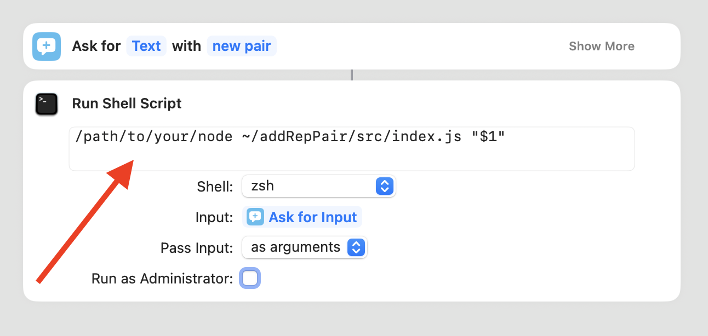

## [](https://qlty.sh/gh/mxclg/projects/addRepPair)

# AddRepPair

It's a tool for adding `trigger = replacement` pairs to the [Espanso](https://espanso.org/) configuration file. It is designed to be used together with macOS [Shortcuts app](https://support.apple.com/en-gb/guide/shortcuts-mac/apdf22b0444c/mac).

## Requirements

- [Node.js](https://nodejs.org/en) (v18 or higher). To check your Node.js version, use the command `node -v`.
- macOS with the [Shortcuts app](https://apps.apple.com/us/app/shortcuts/id915249334) installed.

## Installation and Preparing

1.  Clone the repository:

```
git clone https://github.com/mxclg/addRepPair.git
```

2.  Move into the project folder:

```
cd addRepPair
```

3.  Install dependencies:

```
npm install
```

## How to use

1.  Open the `Add-text-replacement.shortcut` file from the `shortcutsApp` folder located in the root of the project,
    and import it into the `Shortcuts app` on your Mac.
2.  Click `Edit` the `Add-text-replacement.shortcut` and add path to your Node.js binary in the system. If you don't know the path, use the `which node` command in the terminal.
    
3.  Open the `basePath.js` file located in the `src` folder, and set the path to your Espanso configuration file on your computer:

```
export const espansoConfigBase = "/your/path/to/espanso/base.yml"
```

4.  Run the Shortcut `Add text replacement` and add a pair the `trigger = replacement` format.
